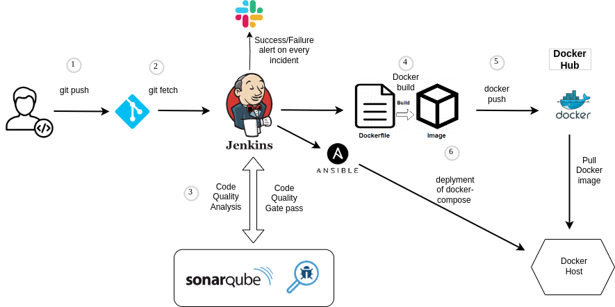
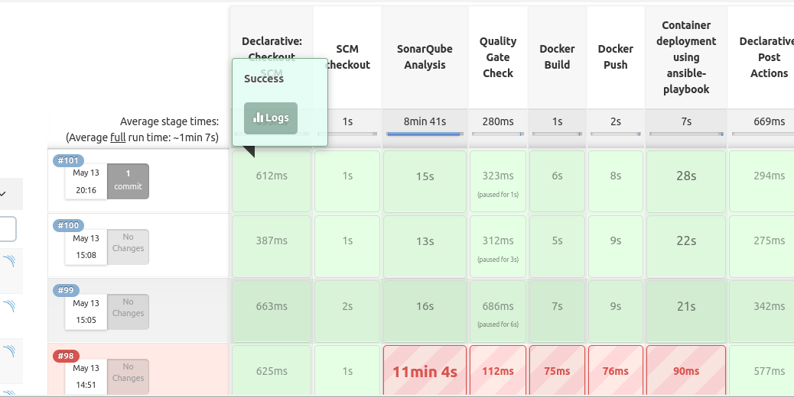
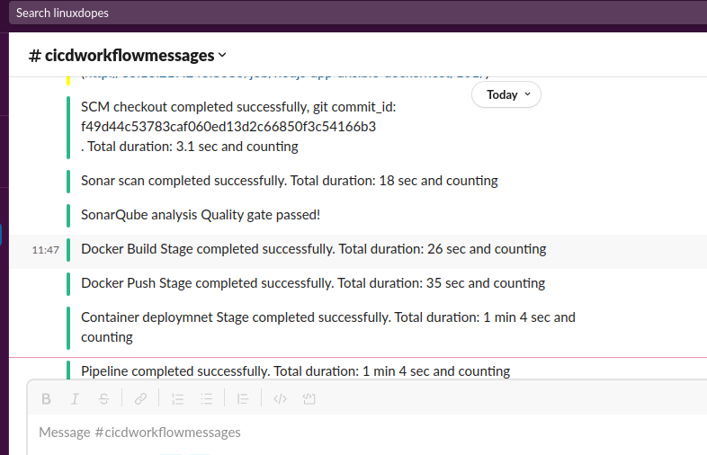
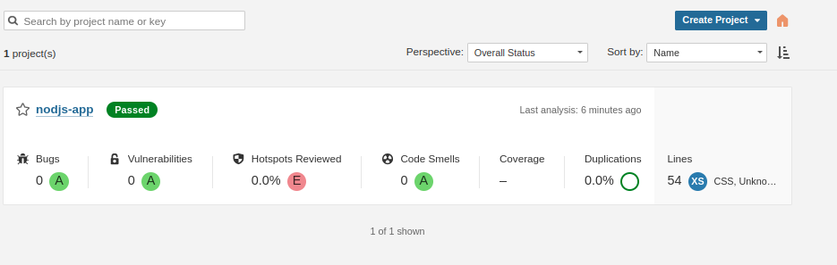
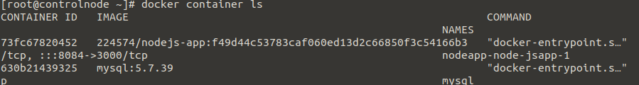

# Node.js MySQL App Deployment with Jenkins, Sonarqube, Docker, DockerHub, and Ansible

This project demonstrates how to automate the deployment of a Node.js MySQL app deployment project that uses Git, Jenkins, SonarQube, Docker, Docker Compose, DockerHub, Ansible, and Slack. The project automates the deployment process by using Jenkins to build and test the app, Docker to containerize it, Docker Compose to orchestrate the containers, Ansible to configure the deployment environment, and Slack to notify the team of each deployment stages status.

## Overview

The deployment process involves the following steps:

1. Jenkins clone the repository to and scan the nodejs code with sonarscanner and generate report to sonarqube server.
2. Jenkins builds a Docker image for the Node.js app and pushes it to DockerHub.
3. Jenkins triggers an Ansible playbook to pulls the Docker image from DockerHub, stops and removes any running containers that were created from the same image, and runs a new container from the updated image.

## Prerequisites

Before you begin, ensure that you have the following prerequisites:

- Jenkins server with Docker and Ansible plugins installed.
- DockerHub account to store Docker images.
- Ansible installed on the Jenkins server.
- Docker installed on your jenkins machine and remote machine.
- Docker Python module installed on the remote Docker host.
- Access to a remote server where your application will be deployed.
- Access to a Slack workspace to receive deployment notifications.

## Getting Started

Follow the steps below to set up the project and deploy the Node.js MySQL app:

1. Clone the Repository:

```bash
git clone https://github.com/abhilashkb/nodejs-app-ci-cd-with-jenkins-git-docker-dockerhub-ansible.git
```

2. Configure the App:

   - Open the project directory.
   - Update the app configuration file (`config.js`) with the necessary database connection details and other settings.

3. Set Up Jenkins:

   - Install Jenkins on your server or a cloud instance.
   - Configure Jenkins and install necessary plugins (e.g., Git Plugin, Docker Plugin, Slack Notification Plugin).
   - Set up Jenkins credentials for accessing the Git repository, DockerHub, and Slack.

4. Configure SonarQube:

   - Install SonarQube on your server or a cloud instance.
   - Configure SonarQube and set up a SonarQube server in Jenkins.
   - Define SonarQube quality profiles and rules for the Node.js project.

5. Set Up Docker and Docker Compose:

   - Install Docker and Docker Compose on the deployment server.
   - Build and push Docker images for the Node.js app and MySQL database to DockerHub.
   - Update the Docker Compose file (`docker-compose.yml`) with the appropriate image tags and environment variables.

6. Configure Ansible:

   - Install Ansible on your local machine.
   - Create an Ansible inventory file with the details of the deployment server.
   - Define Ansible playbooks to provision the server and deploy the app.

7. Set Up Slack Integration:

   - Create a Slack workspace or use an existing one.
   - Configure incoming webhooks and obtain the webhook URL.
   - Update the Jenkins pipeline script (`Jenkinsfile`) to send deployment notifications to Slack.

8. Configure Jenkins Pipeline:

   - Create a Jenkins pipeline job or update an existing one.
   - Define the pipeline stages for building, testing, and deploying the app.
   - Set up integration with Git, SonarQube, Docker, and Slack.

9. Trigger the Jenkins Pipeline:

   - Commit and push your changes to the Git repository.
   - Trigger the Jenkins pipeline manually or set up webhooks for automatic triggering.

10. Monitor the Deployment:

    - Access the Jenkins dashboard to monitor the pipeline execution and view build logs.
    - Check the SonarQube server for code analysis results and quality metrics.
    - Monitor the Slack channel for deployment notifications and alerts.

Certainly! Here's an example of a screenshot section you can add to your README file to demonstrate your project:

## Screenshots

Included relevant screenshots of the project to provide visual representation and demonstrate its functionality. Here are some example screenshots:

1. **Jenkins Pipeline Overview**: This screenshot shows the overview of the Jenkins pipeline in the Jenkins web interface. It showcases the different stages and their execution status.

   

2. **Slack Notifications**: This screenshot demonstrates the Slack notifications sent by the pipeline at different stages. It includes both success messages and failure messages with error details.

   

3. **SonarQube Analysis Report**: This screenshot showcases the SonarQube analysis report generated by the pipeline. It includes code quality metrics, test coverage, and other relevant information.

   

4. **Docker Container Deployment**: This screenshot illustrates the successful deployment of the Node.js application on the Docker host. It verifies that the application is up and running.

   


I hope this helps! Let me know if you have any further questions.
## Acknowledgments

- [Jenkins Documentation](https://www.jenkins.io/doc/)
- [Docker Documentation](https://docs.docker.com/)
- [Ansible Documentation](https://docs.ansible.com/)
- [Sonarqube Documentation](https://docs.sonarqube.org/latest/analyzing-source-code/scanners/jenkins-extension-sonarqube/)
